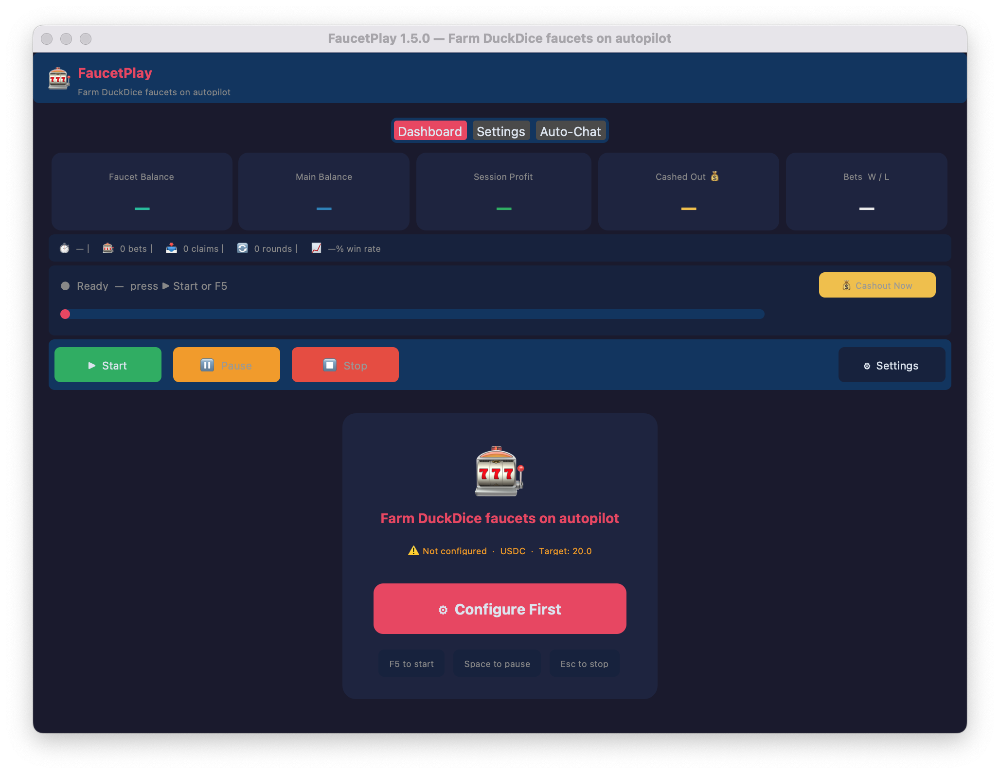
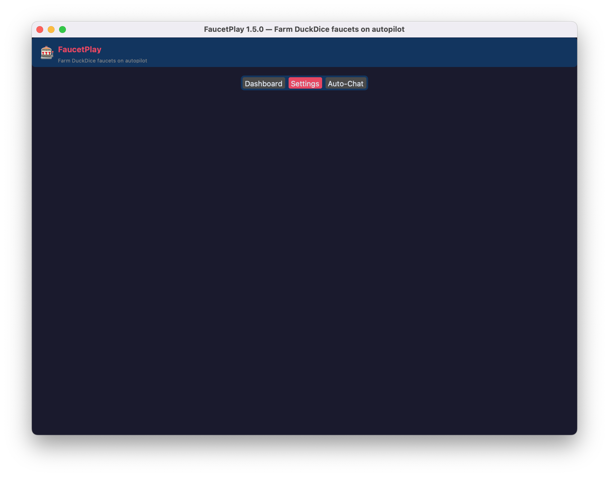

<div align="center">

# 🎰 FaucetPlay

### Farm DuckDice faucets 24/7 on complete autopilot

[](https://github.com/sushiomsky/faucetplay/releases/latest)
[](https://github.com/sushiomsky/faucetplay/actions)
[](#-install)
[](LICENSE)

**Set it and forget it.** Download, configure once, and let FaucetPlay run 24/7 farming your DuckDice faucets automatically — claiming, playing games, betting, cashing out, and repeating without any babysitting.

[📥 Download](#-install) · [🚀 Get Started](#-quick-start) · [❓ FAQ](#-faq) · [📋 What's New](#-changelog)

</div>

---

## 🖼️ Dashboard



The main dashboard shows your current balance, faucet earnings, target progress, and a live log of what's happening. Just start the bot and watch it work.

---

## ✨ What It Does

### ⏰ Claim on Schedule
Set up to 3 claim times per day (e.g., 09:00, 12:00, 18:00). FaucetPlay claims automatically and adds random jitter to avoid patterns.

### 🎮 Auto-plays Tic-Tac-Toe
Low PAW levels require games before claiming. FaucetPlay plays them all automatically in a headless browser — you never see it, but it just works.

### 🎯 Smart Betting
Choose your strategy:
- **All-In** — one big swing for the target
- **Martingale** — double after each loss
- **Reverse Martingale** — ride the hot streaks
- **D'Alembert** — steady increase/decrease
- **Fibonacci** — classic sequence
- **Fixed %** — steady x% of balance each round
- **Custom Lua** — write your own strategy

### 💰 Auto-Cashout
Once your faucet balance hits your target, FaucetPlay automatically cashes out to your main wallet. Then it starts farming again.

### 🌙 24/7 Unattended
Run it headless (no GUI) on a server or always-on PC. The bot handles everything.

### 💬 Auto-Chat
Keep your account active by posting randomized messages to chat at configurable intervals. Great for staying engaged without babysitting the game.

---

## 🖼️ Settings & Configuration


Simple, intuitive settings panel. Enter your API key and session cookie once, choose your betting strategy, set claim times, and you're done.

---

## 🖼️ Auto-Chat Manager



Add or remove chat messages, control send intervals, set rest periods (e.g., no chat between 10 PM and 8 AM), and enable dry-run mode to test without posting live.

---

## 📥 Install

### Option A — Download & Run (Windows, macOS, or Linux)

Go to [**Releases**](https://github.com/sushiomsky/faucetplay/releases/latest) and download the version for your OS:

- **Windows 10/11** → `FaucetPlay-Windows.zip`  
- **macOS Intel** (2015–2020) → `FaucetPlay-macOS-Intel.dmg`  
- **macOS Apple Silicon** (M1/M2/M3/M4) → `FaucetPlay-macOS-AppleSilicon.dmg`  
- **Linux x64** → `FaucetPlay-Linux.tar.gz`

Extract and run. No Python, no installation needed.

> **Not sure which Mac you have?**  
> Apple menu → About This Mac. Intel chip = Intel DMG. M1/M2/M3/M4 = Apple Silicon DMG.

### Option B — Run from Source

If you're a developer or prefer the latest dev build:

```bash
git clone https://github.com/sushiomsky/faucetplay.git
cd faucetplay
pip install -r requirements.txt
playwright install chromium
python faucetplay_app.py
```

---

## ✨ Current Features (v1.5.0)

### 🤖 Faucet Automation
| Feature | Details |
|---|---|
| 🎯 **PAW-aware claiming** | Detects your account level (0–5) and handles the correct claim flow automatically |
| 🎮 **Tic-Tac-Toe engine** | Plays all required games using minimax — never loses, completes instantly |
| 🔁 **Continuous loop** | Claim → bet → cashout → repeat, fully unattended |
| ⏳ **Cooldown aware** | Pauses during cashout cooldowns; never wastes bets |

### 🎲 Betting Strategies
| Strategy | What It Does |
|---|---|
| **All-In** | One big bet to reach target |
| **Martingale** | Double after losing, reset on win |
| **Reverse Martingale** | Double on win, reset on loss |
| **D'Alembert** | Gradual +1/−1 system |
| **Fibonacci** | Follow the sequence |
| **Fixed %** | Always bet x% of balance |
| **Custom Lua** | Full control with your own script |

### 🌐 Browser & Session  
| Feature | Details |
|---|---|
| 🔍 **Auto-extract cookies** | Reads directly from Chrome/Firefox — no copy-paste needed |
| 💾 **Persistent session** | Log in once, auto-login every time after |
| 🌐 **Browser mode** | Routes requests through a real browser for best compatibility |

### 🔒 Security
| Feature | Details |
|---|---|
| 🔐 **Encrypted storage** | API key and cookie encrypted locally — never sent anywhere |
| 🗝️ **Key isolation** | Encryption key stored with mode 0o600 |
| 🚫 **No log leaks** | Credentials never appear in logs |

### ⏰ Scheduler
| Feature | Details |
|---|---|
| **Daily claim times** | Up to 3 times per day (e.g. 09:00, 12:00, 18:00) |
| **Jitter** | Random ±N minutes added to avoid patterns |
| **System auto-start** | Register to launch minimized at login |
| **Headless mode** | Run with `--no-gui` on servers with no display |

### 🖥️ GUI
| Feature | Details |
|---|---|
| **Setup wizard** | First-run onboarding in under 2 minutes |
| **Live dashboard** | Real-time balance, progress, win/loss counts |
| **Toast alerts** | Quick notifications for wins and errors |
| **In-app feedback** | Report bugs directly to GitHub |
| **Auto-update** | Checks for new versions on startup |
| **Dark mode** | Easy on the eyes 24/7 |

### 💬 Auto-Chat
| Feature | Details |
|---|---|
| **Randomized posts** | Pick from your message database at intervals |
| **100 default messages** | Pre-loaded, ready to use |
| **Dry-run mode** | Test messages before posting live |
| **Rest periods** | Silence chat overnight or during specific hours |
| **Message manager** | Add/remove messages, toggle per-message |
| **Activity log** | See last 30 sent/dry-run entries |

---

## 🚀 Quick Start

1. **Download** and launch FaucetPlay
2. **Setup wizard** — enter your DuckDice API key (found in Settings → API)
3. **Add session cookie** — click the auto-detect button to read from Chrome/Firefox, or paste manually
4. **Set target amount** — e.g., 20.0 USDC
5. **Choose strategy** — default is All-In (go big or go home)
6. **Click Start Farming**

That's it. The bot runs in the background and:
- ✅ Claims your faucet on schedule
- ✅ Plays Tic-Tac-Toe automatically
- ✅ Bets toward your target
- ✅ Cashes out when done
- ✅ Repeats 24/7

> **First run tip:** PAW levels 0–3 require games. FaucetPlay plays them in a hidden browser — takes a few seconds, then moves on. No babysitting needed.

---

## ❓ FAQ

**Q: Is it safe? Can my credentials leak?**  
A: Your API key and session cookie are encrypted with AES and stored only locally on your machine. Never sent anywhere. Encryption key is protected (mode 0o600) and never bundled in the app.

**Q: Do I need Python installed?**  
A: No, not if you download the pre-built binary. It's standalone.

**Q: Can I run it on a server with no display?**  
A: Yes. Use `--no-gui` flag and the bot runs headless with your saved config.

**Q: Can I customize the betting strategy?**  
A: Yes. The default strategies cover most use cases. For advanced users, you can provide a custom Lua script for full control.

**Q: Will the bot play Tic-Tac-Toe for me?**  
A: Yes, automatically. You never see it — it happens in a headless browser in seconds.

**Q: Can I set multiple claim times?**  
A: Yes, up to 3 times per day. Each gets a random jitter offset.

**Q: Does it auto-update?**  
A: Yes. On startup, it checks GitHub for new releases and shows a download link if an update is available.

---

## 🗺️ Roadmap (Planned Features)

- [ ] Web UI alternative to desktop GUI
- [ ] Cloud session backup (encrypted)
- [ ] Multi-account farming
- [ ] Advanced analytics & performance charts
- [ ] Mobile app for monitoring

---

## 📋 Changelog

### v1.5.0 — Auto-Chat & UX Polish
- ✨ **Auto-Chat feature** — randomized message posting with message database, intervals, rest periods, and dry-run mode
- 🎨 **Chat panel redesign** — two-pane layout with message manager, activity log, and Send Now button
- 🔄 **Auto-update improved** — real Download button in banner with progress bar
- 🔐 **Security hardening** — no credentials in release bundles, Playwright session secure
- ✅ **CI/CD verification** — automated checks to ensure builds are credential-free
- 🚀 **Download dialog** — progress bar, file count, and Open Folder button

### v1.4.0 — Tic-Tac-Toe & Strategies
- ✨ **TTT auto-play** — minimax solver for all required games
- ✨ **Custom Lua scripts** — write your own betting logic  
- 🎨 **Dashboard redesign** — live balance, progress bar, win/loss counters
- 💬 **In-app feedback** — report bugs directly to GitHub Issues
- 🔍 **Cookie auto-detect** — read from Chrome/Firefox automatically

### v1.3.0 — Core Automation
- ✨ **Faucet farming loop** — claim, bet, cashout, repeat
- 📅 **Scheduler** — daily claim times with jitter and auto-start
- 🎲 **Betting strategies** — All-In, Martingale, Reverse Martingale, D'Alembert, Fibonacci, Fixed %
- 🔐 **Encrypted config** — API key and cookie stored securely locally
- 🌐 **Browser session mode** — use real browser context for best compatibility

---

## 🛠️ For Developers

### Building from Source

```bash
pip install pyinstaller
pyinstaller faucetplay.spec
# Output: dist/FaucetPlay/
```

### Lint & Tests

```bash
flake8 . --select=E9,F63,F7,F82  # Fatal errors only
python -c "from core import DuckDiceAPI, BotConfig, FaucetBot; print('OK')"
```

### Architecture

```
faucetplay_app.py       Entry point
core/
  bot.py                State machine (FARMING → CASHOUT → POST_CASHOUT → STOPPED)
  api.py                DuckDice REST API wrapper
  chat_bot.py           Auto-Chat scheduling and message posting
  config.py             Settings storage (encrypted)
  scheduler.py          Daily claim times with jitter
  version.py            Version & changelog
gui/
  main_window.py        Main window & dashboard
  chat_panel.py         Auto-Chat manager
  settings_panel.py     Settings UI
  theme.py              Colors & fonts
```

---

## 📄 License

MIT — See [LICENSE](LICENSE)

---

## 🤝 Contributing

Found a bug? Have a feature idea? [Open an issue](https://github.com/sushiomsky/faucetplay/issues) or use the in-app feedback button (no account needed).

---

**Made with ❤️ for DuckDice farmers everywhere.**

> The `FEEDBACK_TOKEN` placeholder in `core/version.py` is substituted with the `FEEDBACK_TOKEN` repository secret at build time to enable in-app GitHub Issue submission.

---

## 🗺️ Planned Features & Roadmap

> See [ROADMAP.md](ROADMAP.md) for full detail on each phase.

### Near-Term (Phase 2–3)
- **Multi-account manager** — unlimited DuckDice accounts from one window
- **Proxy & VPN isolation** — one network profile permanently bound to one account; never shared
- **Account dashboard** — per-account live status, PAW badge, network badge, balance cards
- **Import accounts from CSV** — bulk onboarding for power users

### Scheduler Improvements (Phase 4)
- Per-account claim time windows with weekday selection
- Claim-only mode (no betting) + combined claim-and-bet mode
- Session time windows with timezone support and max-duration limits
- Conditional stops: stop after +Y profit or after Z consecutive losses
- Weekly calendar grid UI

### Advanced Strategies (Phase 5)
- **Paroli** — press 3 consecutive wins then reset
- **Strategy backtester** — simulate N rounds with any strategy; show ROI curve
- Per-strategy stop-loss, take-profit, max bet cap, reset trigger
- Custom Lua script loader with full API access

### Multi-Currency Portfolio (Phase 6)
- Farm BTC, DOGE, USDC, ETH, LTC simultaneously per account
- Portfolio overview: all currencies × all accounts in USD
- Exchange rate feed via CoinGecko (no API key required)
- Historical balance chart per currency per account

### Auto Withdrawal (Phase 7)
- Faucet → Main wallet cashout integration
- Configurable daily withdrawal limit safety cap per account
- Address whitelist and withdrawal confirmation countdown
- Full transaction history log (SQLite)

### Analytics (Phase 8)
- Session history database (SQLite) — every bet from every account
- Profit/loss chart (hourly, daily, weekly)
- Win/loss streak tracker, bet distribution histogram
- CSV / Excel export and cross-account aggregate report

### Notifications (Phase 9)
- Desktop toast notifications
- Telegram bot integration — live session updates to your phone
- Discord webhook — post wins and targets to your server
- Email alerts via SMTP

### Distribution (Phase 10)
- Inno Setup Windows installer with start menu shortcuts
- `.deb` and AppImage packages for Linux
- SHA256 checksums published with every release
- Windows Defender / VirusTotal clean-check in CI

---

## 🏗️ Architecture

```
faucetplay_app.py           Entry point — CLI args, wires core + GUI
core/
  bot.py                    FaucetBot state machine (FARMING → CASHOUT_WAIT → POST_CASHOUT → STOPPED)
  api.py                    DuckDiceAPI — REST wrapper with retry/back-off and cookie auth
  config.py                 BotConfig — settings at ~/.faucetplay_bot/config.json
  strategies.py             BettingStrategy base class + 6 implementations + factory
  tictactoe.py              TicTacToeClaimEngine — Playwright browser + minimax solver
  browser_session.py        BrowserSession — persistent Playwright APIRequestContext
  cookie_extractor.py       Auto-extract cookies from Chrome / Firefox
  scheduler.py              BotScheduler — daily claim times with jitter, auto-start
  updater.py                GitHub releases API version check on startup
  version.py                APP_VERSION, repo URLs, changelog
gui/
  main_window.py            MainWindow (CustomTkinter) — bot runs in background thread
  theme.py                  All colour/font/sizing constants
  settings_panel.py         Settings UI — reads/writes BotConfig
  wizard.py                 First-run onboarding wizard
  toast.py                  Toast notification manager
  feedback_dialog.py        In-app bug/feature report → GitHub Issues API
faucet_adaptive_strategy.lua   Lua script for DuckDice's built-in script runner
strategy_configurator.py       Generates Lua script + strategy_config.json
```

---

## ❓ FAQ

**Does this work with all PAW levels?**  
Yes. PAW 0 requires ~5 TTT games, PAW 1 ~4, PAW 2 ~3, PAW 3 ~1, PAW 4–5 use a direct API claim. FaucetPlay detects your level and handles everything automatically.

**Is my account safe?**  
FaucetPlay replicates normal browser behavior — same TLS fingerprint, cookies, and request headers as a real Chrome session. Credentials are stored encrypted on your device. That said, automation is against DuckDice's ToS — use at your own risk.

**Why does the bot sometimes pause?**  
DuckDice enforces cashout cooldowns (typically 1 hour). When FaucetPlay hits its target and a cooldown is active, it waits, then cashes out and resumes automatically.

**My cookie keeps expiring — what do I do?**  
Enable **Browser Session** mode in Settings. This uses Playwright's full session persistence and reuses cookies across restarts, dramatically reducing re-authentication frequency.

**Can I run it headlessly on a server?**  
Yes: `python faucetplay_app.py --no-gui`. The scheduler runs fully automated daily claims without any display.

**How do I auto-start FaucetPlay at boot?**  
Settings → Auto-Start → enable **System Auto-Start**. FaucetPlay registers itself with the OS startup mechanism and launches minimized to the system tray.

**Will it update itself automatically?**  
FaucetPlay checks GitHub releases on every startup. When a new version is found, a banner appears with a direct link to download the new package. One-click auto-update is on the roadmap.

**How do I report a bug or suggest a feature?**  
Settings → About → **🐛 Report Bug** or **💡 Feature Request**. This posts directly to GitHub Issues with your app version, OS, and recent log lines attached — no GitHub account needed.

---

## 📋 Changelog

### v1.5.0 — Auto-Chat & UX Overhaul
- 💬 **Auto-Chat engine** — sends random messages to DuckDice chat on a randomised schedule
- 📦 100 default messages seeded in a local SQLite database (`~/.faucetplay_bot/chat_messages.db`)
- 🔇 **Dry-run ON by default** — nothing is sent until you flip the switch to Live mode
- ⏱  **Configurable interval** (min/max seconds) with random jitter between messages
- 🌙 **Rest periods** — silence chat during overnight or any HH:MM windows
- ⚡ **Send Now** — force an immediate message without waiting for the next interval
- 📝 **Message manager** — live search/filter, count badge, Enable/Disable All, per-row toggle & delete, Enter-to-add
- 📡 **Activity mini-log** — last 30 sent/dry-run entries shown live in the Auto-Chat tab
- 🟡 **Unsaved-changes indicator** — Save buttons show `●` when there are pending changes

### v1.4.0 — Automatic Cookie Extraction & Playwright Browser Session
- 🔍 **Detect from Chrome/Firefox** — reads `duckdice.io` cookies from your installed browser (no login required if already signed in)
- 🤖 **Auto-Extract** saves full `browser_state.json` — session reused on future runs, no re-login needed
- 🌐 **Browser Session mode** — all API calls routed through Playwright's `APIRequestContext` (identical TLS fingerprint to a real browser)
- `core/browser_session.py` — persistent Playwright session, drop-in for `requests`
- `core/cookie_extractor.py` — Chrome/Firefox SQLite + `browser-cookie3` OS keychain support
- Settings panel: two new cookie buttons + Browser Session toggle

### v1.3.0 — Multiple Betting Strategies
- 6 betting modes: All-In, Martingale, Reverse Martingale, Fixed %, D'Alembert, Fibonacci
- Strategy selector in Settings → Betting Mode with context-sensitive fields
- Bot tracks win/loss per roll and passes it to the active strategy
- Strategy state resets cleanly after cashout
- 30 new unit tests covering all strategies and the factory

### v1.2.1 — macOS Compatibility Fix
- Split macOS build: Intel DMG (macOS 10.15+) and Apple Silicon DMG (M1–M4)
- Intel build compiled via Rosetta 2 with `MACOSX_DEPLOYMENT_TARGET=10.15`
- Release notes now guide users to the correct DMG for their Mac

### v1.2.0 — In-App Feedback
- 🐛 Report Bug / 💡 Feature Request buttons in Settings → About
- Posts directly to GitHub Issues — zero login required
- Auto-attaches: app version, OS, Python version, last 30 log lines
- Dev builds fall back to pre-filled browser URL

### v1.1.0 — Reliability & Code Quality
- Fix win/cashout toasts never firing (poll-cycle tracking bug)
- Main Balance card now shows live balance after cashout
- Bet guard: redirects to claim if balance falls below min_bet
- `assert` → `BotError` raise (safe under `python -O`)
- Config: proper logging + `InvalidToken` warning on decrypt fail
- Scheduler: negative jitter now logs correctly
- Settings: jitter field validates input, no more `int()` crash

### v1.0.0 — Initial Release
- PAW-level aware faucet claiming with Tic-Tac-Toe automation
- Adaptive betting strategy engine
- Auto cashout with cooldown awareness
- Daily scheduler with jitter + system auto-start
- Encrypted credential storage
- Auto-update notifications via GitHub releases
- 3-platform binary releases (Windows / macOS / Linux)

---

## ⚠️ Disclaimer

FaucetPlay is provided for educational purposes. Gambling involves real financial risk. Automation may violate DuckDice's Terms of Service. Use at your own discretion and risk. The authors accept no liability for losses or account actions incurred through use of this software.

---

<div align="center">
Made with ❤️ for the DuckDice community &nbsp;·&nbsp; <a href="LICENSE">MIT License</a> &nbsp;·&nbsp; <a href="ROADMAP.md">Roadmap</a> &nbsp;·&nbsp; <a href="CONTRIBUTING.md">Contributing</a>
</div>
